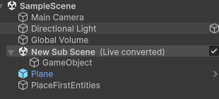
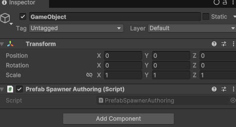
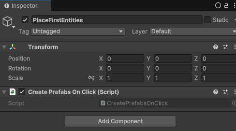

# SETUP INICIAL

 CAMARA
 GameObject
 PlaceFirstEntities

[LISTO] DEBE PERMITIR SELECCIONAR EN EL "MAPA" DONDE SE QUIEREN COLOCAR LA PRIMERA CELULA DE CADA TIPO, DEBE SER ESCALABLE A N TIPO DE CELULAS

LUEGO DEBE DEFINIRSE TANTO LA INTERFAZ GRAFICA COMO EL MOVIMIENTO DE LA CAMARA